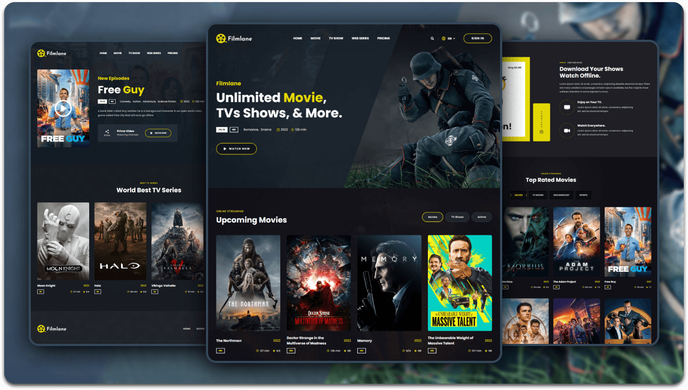

  
  

  <h2 align="center">Filmlane - Movie website</h2>

  Filmlane is a fully responsive movie website page,  Responsive for all devices, built using HTML, CSS, and JavaScript.

 

### Demo Screenshots

### Prerequisites

Before you begin, ensure you have met the following requirements:

* [Git](https://git-scm.com/downloads "Download Git") must be installed on your operating system.

### Contact

If you want to contact with me you can reach me at [LinkedIn](https://linkedin.com/in/liam-thomas21/).

### License

This project is **free to use** and does not contain any license.
